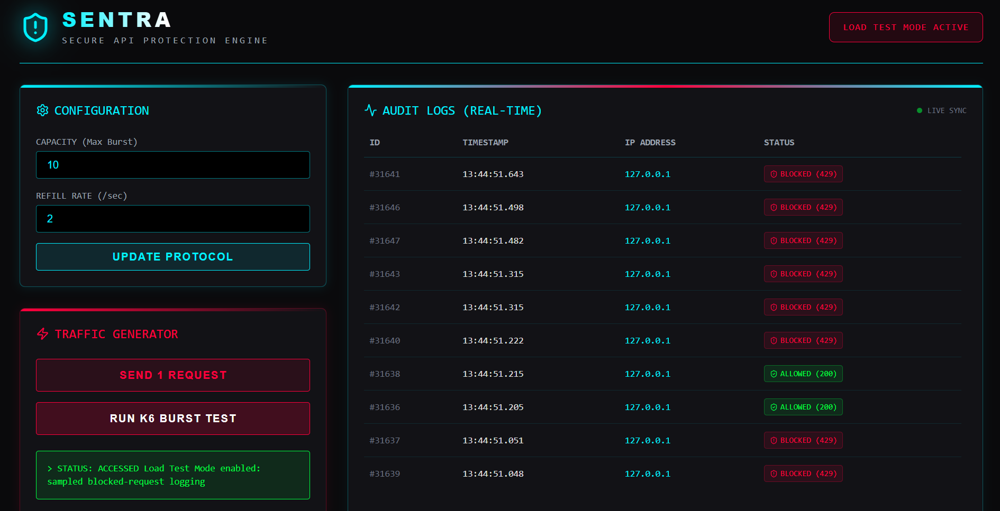

# SENTRA – Secure API Protection Engine

SENTRA is a security-focused API protection engine built with Spring Boot and React that demonstrates real-time rate limiting, concurrent request handling, traffic monitoring, and burst attack protection. It simulates high-volume API traffic using k6 and visualizes allowed/blocked requests through a cyber-themed monitoring dashboard.

---

## 🚀 Features

- Token Bucket rate limiting
- AOP-based request interception
- HTTP 429 protection handling
- Real-time monitoring dashboard
- Security audit logging with SQL
- Concurrent request handling using Java Virtual Threads
- Burst traffic testing using k6
- Configurable rate-limiting protocols
- Live request status visualization
- Demo Mode / Load Test Mode support

---

## 🔗 Live Demo

> **[▶ View Live Project](https://storebox-explorer7.onrender.com/)**  
> Deployed on Render.


## 🛠️ Tech Stack

| Layer | Technologies |
|---|---|
| **Backend** | Java, Spring Boot, Spring AOP, Spring Data JPA, MySQL, Java Virtual Threads |
| **Frontend** | React, Tailwind CSS, Axios, Lucide React |
| **DevOps / Testing** | Docker, k6 Load Testing |

---

## 📸 Screenshots

 <div align="center">
  
</div>

---

## ⚙️ System Architecture

```text
Client Requests
       ↓
AOP Request Interceptor
       ↓
Token Bucket Rate Limiter
       ↓
HTTP 429 Protection
       ↓
Audit Logging + Dashboard Monitoring
```

---

## 📂 Project Structure

```text
backend/
├── annotation/
├── aspect/
├── config/
├── controller/
├── exception/
├── model/
├── repository/
└── service/

---

## ▶️ Running the Project

### Backend

```bash
cd backend
mvn spring-boot:run
```

### Frontend

```bash
cd frontend
npm install
npm run dev
```

---

## 🧪 Running k6 Stress Test

Install k6:

```bash
winget install k6
```

Run the test:

```bash
k6 run sentra-test.js
```

---

## 📊 Stress Testing

SENTRA was tested using k6 burst traffic simulations.

| Metric | Result |
|---|---|
| Burst requests handled | 1,000+ |
| Logging strategy | Sampled audit logging under high load |
| Bottleneck handling | Connection pool throttling demonstrated |

---

## 🔒 Security Concepts Demonstrated

- API abuse prevention
- Rate limiting
- Concurrent traffic control
- Request throttling
- Audit logging
- HTTP 429 responses
- Load testing and stress analysis

---

## 🖥️ Dashboard Features

- Real-time request monitoring
- Allowed / Blocked request visualization
- Security audit logs
- Live sync updates
- Pagination support
- Configurable capacity and refill rate
- k6 burst test trigger from frontend

---

## 📌 Future Improvements

- Redis-backed distributed rate limiting
- JWT authentication integration
- Grafana monitoring integration
- Kafka-based async logging
- IP reputation analysis
- WebSocket live streaming
